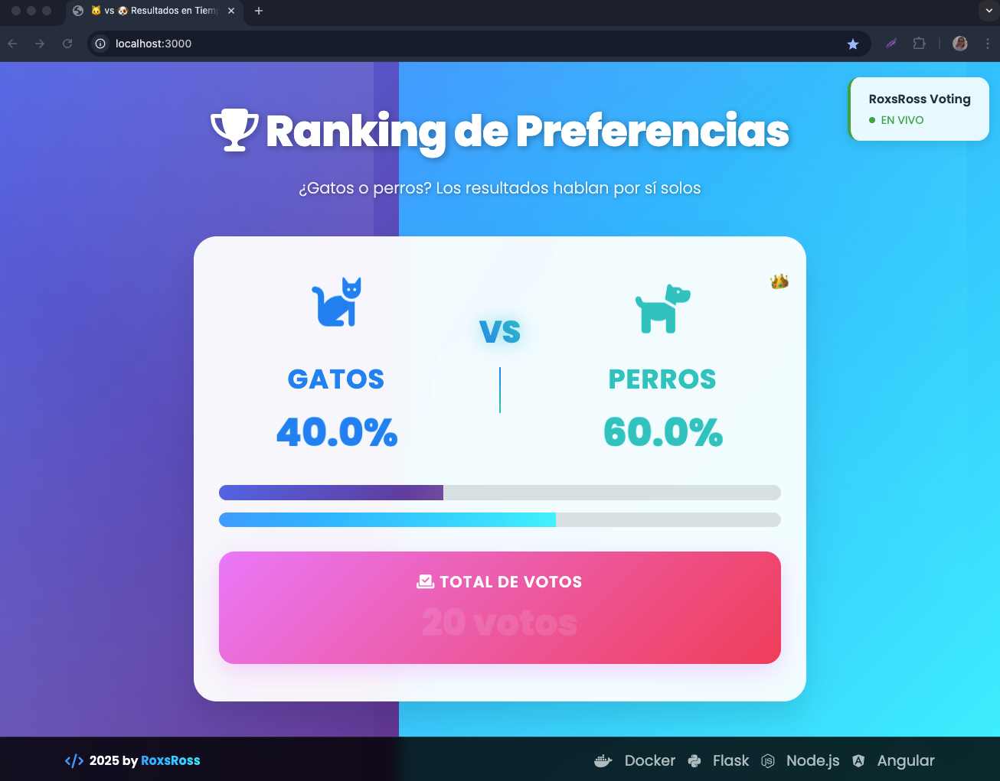
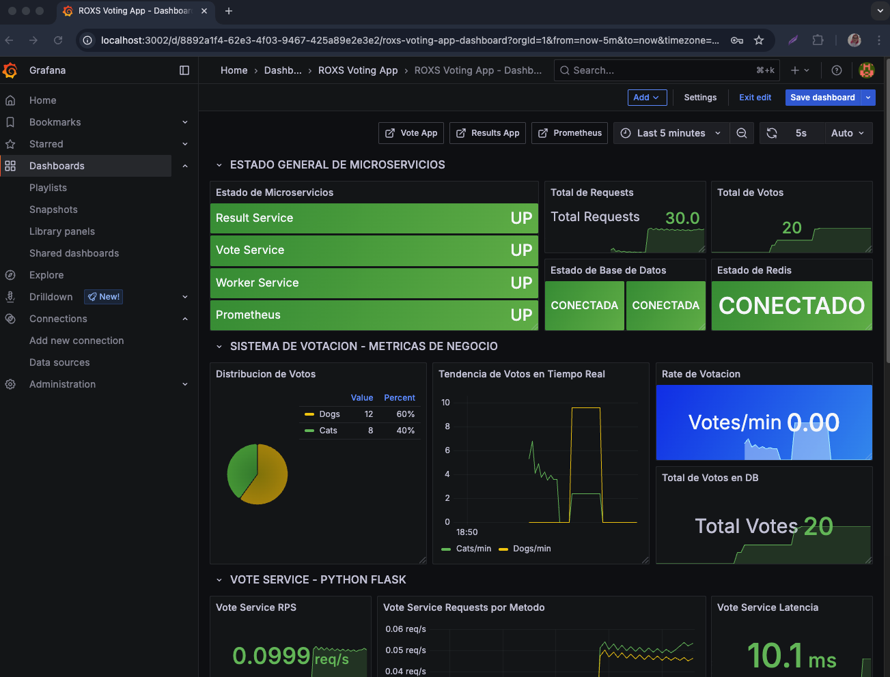
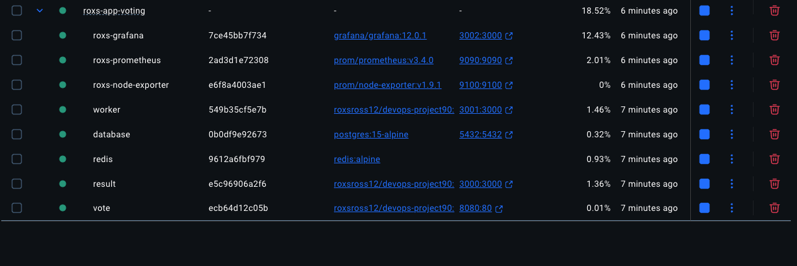

# 🚀 90 Días de DevOps con Roxs


[](https://docker.com)
[](https://nodejs.org)
[](https://nodejs.org)
[](https://flask.palletsprojects.com/)
[](https://redis.io)
[](https://postgresql.org)
[](https://prometheus.io)
[](https://grafana.com)

> **Proyecto educativo de DevOps** creado por **roxsross** para aprender conceptos fundamentales de desarrollo, contenedores, orquestación y monitoreo.
> ℹ️ Este repositorio parte del [Docker Example Voting App](https://github.com/dockersamples/example-voting-app) y ha sido mejorado y adaptado por **roxsross** para el desafío 90 Días de DevOps.


## 🔥 ¿Por qué sumarte?

Porque **aprender DevOps no tiene por qué ser aburrido ni costoso**.  
En este desafío vas a construir, romper y mejorar una app real... **¡con tus propias manos!**  
Con cada semana vas a aprender algo nuevo, y lo más importante: **vas a aplicarlo al instante**.  

📢 *"Si no lo deployás, no lo aprendiste."* — Roxs

## 📸 Screenshots del Ecosistema ROXS

<div align="center">

| 📦 Aplicación Principal | 📋 Resultados | 📊 🏠 Grafana Home | 🐳 Docker Containers |
|:---:|:---:|:---:|:---:|
|  |  |  |  |
| *Sistema de Votación* | *Web Resultados* | *Dash Grafana* | *Contenedores onfire* |

</div>

---

## 🧩 Arquitectura de la Aplicación

Este repositorio incluye el código base de una aplicación distribuida, compuesta por tres servicios:


- **Vote** : Servicio en Flask que permite votar (🐱 o 🐶) y publica los votos en Redis.
- **Worker** : Servicio Node.js que consume votos desde Redis y los guarda en PostgreSQL.
- **Result** : App Node.js que muestra los resultados en tiempo real usando WebSockets.

### 📦 Versiones recomendadas de los servicios

| Servicio | Lenguaje/Framework | Versión recomendada |
|----------|--------------------|---------------------|
| Vote     | Flask (Python)     | Python 3.13+, Flask 3.3+ |
| Worker   | Node.js            | Node.js 20.x+            |
| Result   | Node.js            | Node.js 20.x+            |
| Redis    | Redis                | Redis 6.x+                 |
| PostgreSQL| PostgreSQL          | PostgreSQL 15.x+           |

> ⚠️ Usar versiones iguales o superiores a las recomendadas asegura compatibilidad y soporte con las dependencias del proyecto.
---

## 🛠️ ¿Qué vas a construir?

A lo largo del programa, vos vas a encargarte de:

✅ Crear tus propios archivos `docker-compose.yml`  
✅ Automatizar la configuración con Ansible  
✅ Desplegar todo en local usando Terraform Provider Local  
✅ Crear pipelines CI/CD con GitHub Actions  
✅ Orquestar la app en Kubernetes  
✅ Monitorear con Prometheus y Grafana  
✅ (Opcional) Llevarlo a AWS

---

## 📂 Estructura del Repositorio

```bash
.
├── vote/             # Flask app (app.py)
├── worker/           # Worker Node.js (main.js)
├── result/           # Resultados en tiempo real (main.js)
├── views/            # HTML y frontend
├── load-testing/     # Pruebas de Carga y rendimiento con k6
├── README.md         # Este archivo ;)
````

> ⚠️ No se incluyen archivos de Docker, Terraform o CI/CD. Vos los vas a construir paso a paso como parte del desafío.

---

## 🗓️ Programa Semana a Semana

| Semana | Tema Clave                                 | Proyecto a construir                         |
| ------ | ------------------------------------------ | -------------------------------------------- |
| 1      | Linux + Vagrant + Ansible                  | Levantar app sin Docker usando Vagrant       |
| 2      | Docker y Docker Compose                    | Crear los Dockerfiles y `docker-compose.yml` |
| 3      | GitHub Actions CI/CD                       | Automatizar builds con self-hosted runner    |
| 4      | Terraform (Provider Local)                 | Crear infraestructura local con Terraform    |
| 5      | Kubernetes local con Minikube              | Desplegar app dockerizada en clúster local   |
| 6      | Despliegue con CI/CD a Kubernetes          | Automatizar despliegues en k8s               |
| 7      | Seguridad en Contenedores                  | Integrar herramientas de vulnerabilidades    |
| 8      | Troubleshooting + Performance              | Debug y tuning de recursos                   |
| 9      | Despliegue en la Nube (EC2/EKS - Opcional) | Llevar tu app a AWS                          |

---

## 🤘 ¿Cómo empiezo?

Cloná el repo y seguí el material semanal en el sitio del programa.

```bash
git clone https://github.com/roxsross/roxs-devops-project90.git
cd roxs-devops-project90
```

El código está listo para que lo personalices, dockerices y automatices.

---

## 📈 Bonus: Métricas y Observabilidad

Todos los servicios están instrumentados con Prometheus. Podrás visualizar las métricas que vos mismo vas a recolectar y graficar con Grafana a partir de la semana 6.

---
## 💪 Motivación: ¿Por qué hacer este desafío?

Aprender DevOps puede parecer abrumador. Hay muchas herramientas, conceptos nuevos, y cientos de tutoriales que te dicen por dónde empezar… pero ninguno te lleva de la mano a construir algo real **desde cero**.

Este programa no es teoría vacía. Vas a **construir una app real**, como lo harías en un equipo profesional.
Acá vas a **equivocarte, arreglar, automatizar, monitorear y desplegar**.
Y cuando termines, vas a poder decir con orgullo: **yo hice esto** 💥

> 🧠 *"DevOps no se aprende en un curso, se aprende en la práctica. Y este es tu campo de juego."*


---


## 🧰 Recursos complementarios (para cada herramienta)

| Herramienta    | Documentación Oficial                                                                                  | Recurso Recomendado                                                                                         |
| -------------- | ------------------------------------------------------------------------------------------------------ | ----------------------------------------------------------------------------------------------------------- |
| Docker         | [https://docs.docker.com/](https://docs.docker.com/)                                                   | [Docker Workshop](https://docs.docker.com/get-started/workshop/)                                                        |
| Ansible        | [https://docs.ansible.com/](https://docs.ansible.com/)                                                 | [Ansible para principiantes](https://developers.redhat.com/products/ansible/getting-started)                         |
| Terraform      | [https://developer.hashicorp.com/terraform/](https://developer.hashicorp.com/terraform/)               | [Guía de Terraform en español](https://learn.hashicorp.com/terraform)                                       |
| Kubernetes     | [https://kubernetes.io/docs/home/](https://kubernetes.io/docs/home/)                                   | [Kubernetes The Hard Way (by Kelsey Hightower)](https://github.com/kelseyhightower/kubernetes-the-hard-way) |
| GitHub Actions | [https://docs.github.com/actions](https://docs.github.com/actions)                                     | [Curso Gratuito GitHub Actions](https://docs.github.com/en/actions/quickstart)                              |
| Prometheus     | [https://prometheus.io/docs/introduction/overview/](https://prometheus.io/docs/introduction/overview/) | [Observabilidad ](https://opentelemetry.io/es/docs/concepts/observability-primer/)                                   |
| Grafana        | [https://grafana.com/docs/](https://grafana.com/docs/)                                                 | [Dashboards y Alertas con Grafana](https://grafana.com/tutorials/)                                          |
| PostgreSQL     | [https://www.postgresql.org/docs/](https://www.postgresql.org/docs/)                                   | [PostgreSQL Tutorial](https://www.postgresqltutorial.com/)                                                  |
| Redis          | [https://redis.io/docs/](https://redis.io/docs/)                                                       | [Aprendé Redis](https://redis.io/learn/howtos/quick-start)                                                           |

> 🛠️ Tip: Agregá estos links como favoritos, los vas a necesitar cuando te enfrentes a errores reales 😉

---

## 🗺️ DevOps Roadmap para Principiantes

```
✔️ 1. Entender Linux y la terminal
✔️ 2. Automatizar entornos con Vagrant y Ansible
✔️ 3. Construir imágenes con Docker
✔️ 4. Orquestar servicios con Docker Compose
✔️ 5. Crear pipelines con GitHub Actions
✔️ 6. Definir infraestructura con Terraform
✔️ 7. Desplegar en Kubernetes (local)
✔️ 8. Agregar métricas con Prometheus y Grafana
✔️ 9. Aprender troubleshooting y performance
✔️ 🔥 BONUS: Subir tu proyecto a la nube (AWS)
```

Roadmap que recomiendo seguir [DevOps](https://roadmap.sh/devops)

### 🎯 Objetivo final:

Tener un **portfolio técnico** completo y práctico, demostrando tus conocimientos en cada área del ciclo de vida DevOps.

---

## 📄 Licencia

Este proyecto está licenciado bajo MIT License - ver el archivo [LICENSE](LICENSE) para detalles.

## 👨‍💻 Autor

**roxsross** - Instructor DevOps y Cloud

- 🐦 Twitter: [@roxsross](https://twitter.com/roxsross)
- 🔗 LinkedIn: [roxsross](https://linkedin.com/in/roxsross)
- ☕ Ko-fi [roxsross](https://ko-fi.com/roxsross)
- ▶️ Youtube [295devops](https://www.youtube.com/@295devops)
- 📧 Email: roxs@295devops.com

---

> 💡 Si querés sumar este desafío a tu portfolio o como parte de tu onboarding, ¡hacelo con orgullo! 💥


